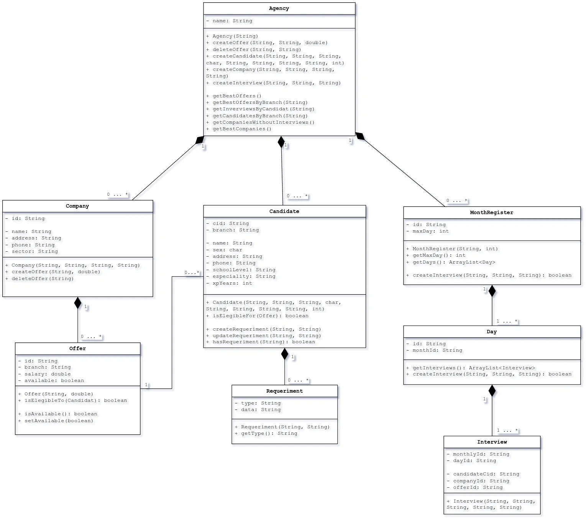

# Tarea Final - Diseño y Programación Orientada a Objetos (DPOO)

Este repositorio contiene el proyecto final de la asignatura Diseño y Programación Orientada a Objetos (DPOO) de la CUJAE. El objetivo principal del programa es la gestión de ofertas de empleo, implementado completamente en Java.

> Tema #7

